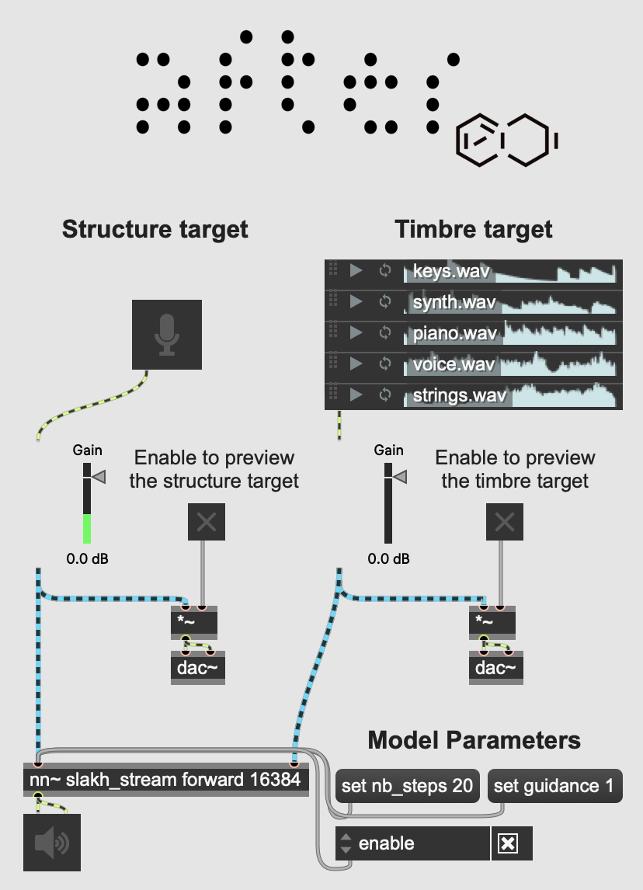

# AFTER: Audio Features Transfer and Exploration in Real-time

__AFTER__ is forked from the [original repository](https://github.com/acids-ircam/AFTER)

## Model Training - Windows Only


### 00 - Installation

``` bash
pip install -r requirements.txt
```


### 01 - Dataset preparation

```bash
python prepare_dataset.py --input_path /audio/folder --output_path /dataset/path --num_signal 262144
```
```bash
python prepare_dataset.py --input_path "C:\Users\jp_ju\OneDrive - Universite de Montreal\Documents\UdeM\MUS3329X-A-H25 - Projet en informatique musicale\DATASETS\jpjpjp" --output_path ./dataset/jpjpjp --num_signal 262144
```
```bash
python prepare_dataset.py --input_path "C:\Users\jp_ju\OneDrive - Universite de Montreal\Documents\UdeM\MUS3329X-A-H25 - Projet en informatique musicale\DATASETS\jpjpjp" --output_path ./dataset/jpjpjp
```


### 02 - Autoencoder training

#### Training
```bash
python train_autoencoder.py --name AE_model_name --db_path /audio/folder  --config baseAE --config causal 
```
```bash
python train_autoencoder.py --name AE_model_jpjpjp --db_path ./dataset/jpjpjp  --config ./autoencoder/configs/baseAE --config ./autoencoder/configs/causal --bsize 2 --gpu 0
```

#### Export

```bash
python export_autoencoder.py --name AE_model_name --step 1000000
```
```bash
python export_autoencoder.py --name AE_model_jpjpjp --step 0
```


### 03 - Offline model training

#### Pre-compute embeddings
```bash
python update_dataset.py --emb_model_path pretrained/AE_model_name.ts --db_path /audio/folder 
```
```bash
python update_dataset.py --emb_model_path ./pretrained/AE_model_jpjpjp.ts --db_path ./dataset/jpjpjp
```

#### Training
```bash
python train_diffusion.py  --name diff_model_name --db_path /dataset/path --emb_model_path pretrained/AE_model_name.ts --config base 
```
```bash
python train_diffusion.py  --name diff_model_jpjpjp --db_path ./dataset/jpjpjp --emb_model_path ./pretrained/AE_model_jpjpjp.ts --config ./diffusion/configs/base --bsize 8 --num_workers 0
```

### 04 - Streaming model distillation

#### Training
```bash
python train_distill_diffusion.py  --name streaming_model_name --db_path /dataset/path --emb_model_path pretrained/AE_model_name.ts --pretrained_model /runs/offline_model_name/ --pretrained_step 1000000 --config streaming
```
```bash
python train_distill_diffusion.py  --name streaming_model_jpjpjp --db_path ./dataset/jpjpjp --emb_model_path ./pretrained/AE_model_jpjpjp.ts --pretrained_model /diff_model_jpjpjp --pretrained_step 0 --config ./diffusion/configs/streaming --bsize 8 --num_workers 0
```


### 05 - Export streaming model

#### Audio-to-Audio
```bash
python export_streaming.py  --name streaming_model_name --step 1000000 --emb_model_path pretrained/AE_model_name_stream.ts 
```
```bash
python export_streaming.py  --name streaming_model_jpjpjp --step 0 --emb_model_path ./pretrained/AE_model_jpjpjp.ts
```

#### MIDI-to-Audio
```bash
python export_streaming_midi.py  --name streaming_midi_model_name --step 1000000 --emb_model_path pretrained/AE_model_name_stream.ts --npoly 4
```
where `npoly` sets the number for voices for polyphony. Make sure to use the streaming version of the exported autoencoder (denoted by _stream.ts).


## 06 - Inference in MaxMSP

### MIDI-to-Audio 

Our MIDI-to-audio model is a 4-voice polyphonic synthesizer that produces audio for pitch and velocity, as well as a timbre target in two modes:
- **Audio-based**: Using the `forward` method, AFTER extracts timbre from an audio stream (with a 3 seconds receptive field). We’ve included audio samples from the training set in the repository.
- **Manual exploration**: The `forward_manual` method lets you explore timbre with 8 sliders, which set a position in a learned 8-dimensional timbre space.

The guidance parameter sets the conditioning strength on the MIDI input, and diffusion steps can be adjusted to improve generation quality (at a higher CPU cost).

Download our instrumental model trained on the [SLAKH](http://www.slakh.com/) dataset [here](https://nubo.ircam.fr/index.php/s/tHMmFmkF6kgn7ND/download).


### Audio-to-Audio 

In audio-to-audio mode, AFTER extracts the time-varying features from one audio stream and applies them to the timbre of a second audio source. The guidance parameter controls the conditioning strength on the structure input, and the diffusion steps improve generation quality with more CPU load.

Download our instrumental model trained on the [SLAKH](http://www.slakh.com/) dataset [here](https://nubo.ircam.fr/index.php/s/NCHZ5Q9aMsFxmyp/download).



## Artistic Applications

AFTER has been applied in several projects:
- [_The Call_](https://www.serpentinegalleries.org/whats-on/holly-herndon-mat-dryhurst-the-call/) by Holly Herndon and Mat Dryhurst, an interactive sound installation with singing voice transfer, at Serpentine Gallery in London until February 2, 2025.
- A live performance by French electronic artist Canblaster for Forum Studio Session at IRCAM. The full concert is available on [YouTube](https://www.youtube.com/watch?v=0E9nNyz4pv4).
- [Nature Manifesto](https://www.centrepompidou.fr/fr/programme/agenda/evenement/dkTTgJv), an immersive sound installation by Björk and Robin Meier, at Centre Pompidou in Paris from November 20 to December 9, 2024.

We look forward to seeing new projects and creative uses of AFTER.
