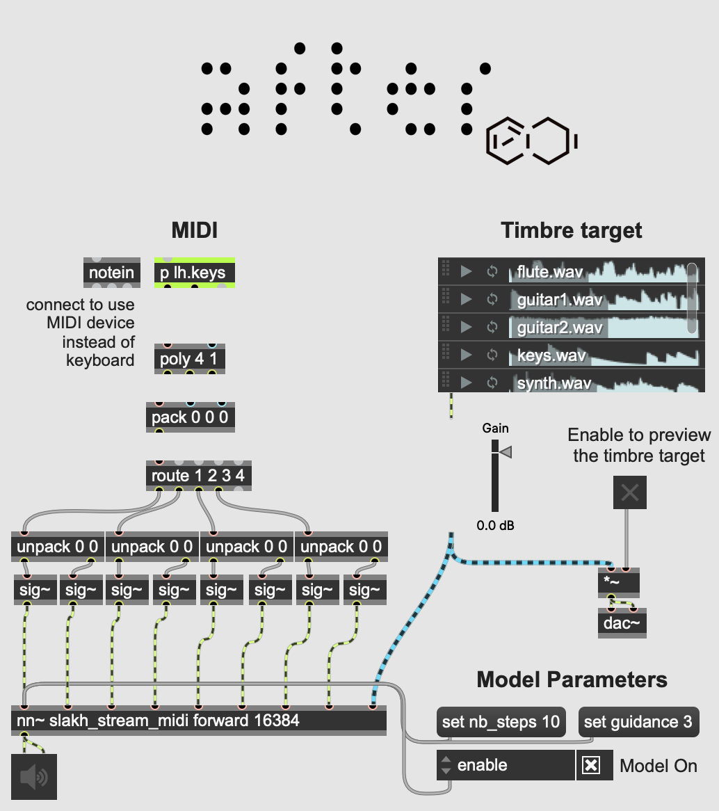
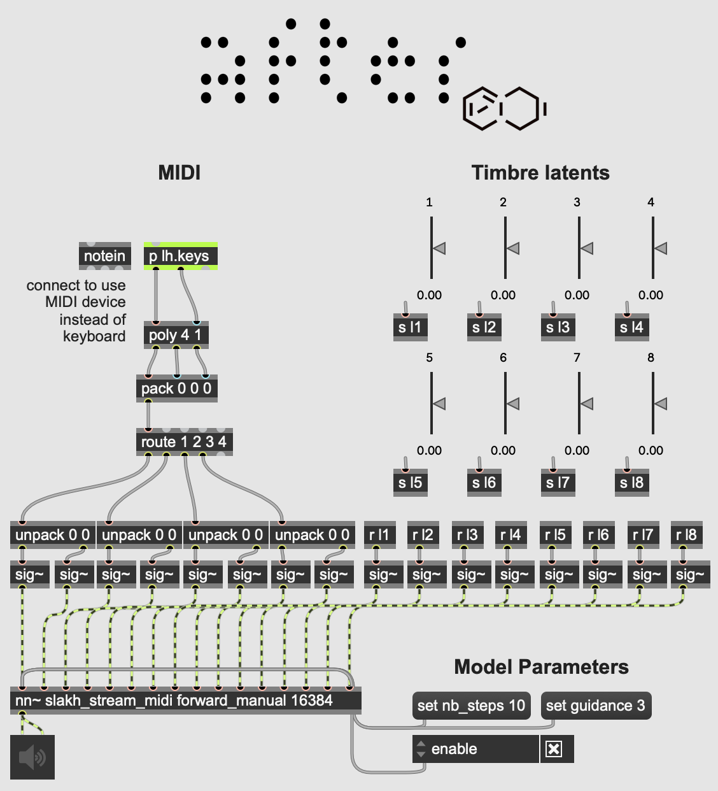

# AFTER: Audio Features Transfer and Exploration in Real-time

__AFTER__ is a diffusion-based generative model that creates new audio by blending two sources: one audio stream to set the style or timbre, and another input (either audio or MIDI) to shape the structure over time.

This repository is a real-time implementation of the research paper _Combining audio control and style transfer using latent diffusion_ ([read it here](https://arxiv.org/abs/2408.00196)) by Nils Demerlé, P. Esling, G. Doras, and D. Genova. The code to train a non-streamable version of this model is available on [GitHub](https://github.com/NilsDem/control-transfer-diffusion/), and transfer examples can be found on the [project webpage](https://nilsdem.github.io/control-transfer-diffusion/). This real-time version integrates with MaxMSP and Ableton Live through [_nn_tilde_](https://github.com/acids-ircam/nn_tilde), an external that embeds PyTorch models into MaxMSP.

We’ll soon release code for training your own streamable models, but in the meantime, three pretrained models are available for you to experiment with.


# Model Training


Training AFTER  involves 4 separate steps, namely _dataset preparation_, _autoencoder training_, _offline model training_ and _streaming model distillation_.

## Installation
After cloning this repository, you can install the dependencies for training with

``` bash
pip install -r requirements
```

## Dataset preparation


```bash
python prepare_dataset.py --input_path /audio/folder --output_path /dataset/path --num_signal 262144
```

The `num_signal` flag sets the duration of the audio chunks for training. 

## Autoencoder training

The autoencoder training is the longest part of AFTER training. A training is started with 

```bash
python train_autoencoder.py --name AE_model_name --db_path /audio/folder  --config baseAE --config causal 
```

where `db_path` refers to the prepared dataset location. The flag `--config causal` greatly decreases the final latency of the model, but can degrade audio quality. The tensorboard logs and checkpoints are saved to  `/autoencoder/runs/AE_model_name`.

After training, the model has to be exported to a torchscript file using

```bash
python export_autoencoder.py --name AE_model_name --step 1000000
```

Alternatively to training an Autoencoder from this repository, you can use a pretrained [RAVE](https://github.com/acids-ircam/RAVE) model, or any streamable autoencoder comiled in a torchscript file and which features `encode` and `decode` methods. 

## Offline model training

Before training our diffusion model in the latent space of the Autoencoder, we pre-compute the latent embeddings to speed up training : 

```bash
python update_dataset.py --emb_model_path pretrained/AE_model_name.ts --db_path /audio/folder 
```

Then, a training is started with 

```bash
python train_diffusion.py  --name diff_model_name --db_path /dataset/path --emb_model_path pretrained/AE_model_name.ts --config base 
```

Different configurations are available in `diffusion/configs` and can be combined :

<table>
  <thead>
    <tr>
      <th>Type</th>
      <th>Name</th>
      <th>Description</th>
    </tr>
  </thead>
  <tbody>
    <tr>
      <td rowspan="2"><strong>architecture</strong></td>
      <td>base</td>
      <td>Standard audio-to-audio timbre and structure separation.</td>
    </tr>
    <tr>
      <td>midi</td>
      <td>Uses MIDI as input for the structure encoder. Ensure that you modify the <code>prepare_dataset.py</code> script to include the associated audio files.</td>
    </tr>
    <tr>
      <td rowspan="2"><strong>training</strong></td>
      <td>quantize</td>
      <td>Uses a quantized representation based on <a href="https://arxiv.org/abs/2309.15505">FSQ</a> for the structure latent space (experimental). Adversarial weight should be decreased when using a small codebook. </td>
    </tr>
    <tr>
      <td>cycle</td>
      <td>Adds a cycle consistency phase during training to improve transfer performance (experimental).</td>
    </tr>
  </tbody>
</table>

The tensorboard logs and checkpoints are saved to  `/diffusion/runs/model_name`, and you can experiment with you trained model using the notebooks `/notebooks/audio_to_audio_demo.ipynb` and `/notebooks/midi_to_audio_demo.ipynb`.

## Streaming model distillation

After training the offline diffusion model, we retain the encoders from the offline training and train a streaming version of the model with : 


```bash
python train_distill_diffusion.py  --name streaming_model_name --db_path /dataset/path --emb_model_path pretrained/AE_model_name.ts --pretrained_model /runs/offline_model_name/ --pretrained_model_step 1000000--config streaming
```

Once the training is complete, you can export the model to a torchscript file for inference in MaxMSP.

For an audio-to-audio model :
```bash
python export_streaming.py  --name streaming_model_name --step 1000000 --emb_model_path pretrained/AE_model_name_stream.ts 
```

For a MIDI-to-audio model :

```bash
python export_streaming_midi.py  --name streaming_midi_model_name --step 1000000 --emb_model_path pretrained/AE_model_name_stream.ts --npoly 4
```

where `npoly` sets the number for voices for polyphony. Make sure to use the streaming version of the exported autoencoder (denoted by _stream.ts).

# Inference in MaxMSP

## Installation

The only dependency for inference is the [_nn_tilde_](https://github.com/acids-ircam/nn_tilde) external.

1. Clone this repository to your local machine.
2. Add it to the list of Max paths (Options -> File Preferences...) with recursive subfolders enabled.
3. Download the pretrained models from the links below and place them in the same directory.


## MIDI-to-Audio 

Our MIDI-to-audio model is a 4-voice polyphonic synthesizer that produces audio for pitch and velocity, as well as a timbre target in two modes:
- **Audio-based**: Using the `forward` method, AFTER extracts timbre from an audio stream (with a 3 seconds receptive field). We’ve included audio samples from the training set in the repository.
- **Manual exploration**: The `forward_manual` method lets you explore timbre with 8 sliders, which set a position in a learned 8-dimensional timbre space.

The guidance parameter sets the conditioning strength on the MIDI input, and diffusion steps can be adjusted to improve generation quality (at a higher CPU cost).

Download our instrumental model trained on the [SLAKH](http://www.slakh.com/) dataset [here](https://nubo.ircam.fr/index.php/s/tHMmFmkF6kgn7ND/download).

Audio Timbre Target           |  Manual Timbre Control
:-------------------------:|:-------------------------:
| 


## Audio-to-Audio 

In audio-to-audio mode, AFTER extracts the time-varying features from one audio stream and applies them to the timbre of a second audio source. The guidance parameter controls the conditioning strength on the structure input, and the diffusion steps improve generation quality with more CPU load.

Download our instrumental model trained on the [SLAKH](http://www.slakh.com/) dataset [here](https://nubo.ircam.fr/index.php/s/NCHZ5Q9aMsFxmyp/download).


# Artistic Applications

AFTER has been applied in several projects:
- [_The Call_](https://www.serpentinegalleries.org/whats-on/holly-herndon-mat-dryhurst-the-call/) by Holly Herndon and Mat Dryhurst, an interactive sound installation with singing voice transfer, at Serpentine Gallery in London until February 2, 2025.
- A live performance by French electronic artist Canblaster for Forum Studio Session at IRCAM. The full concert is available on [YouTube](https://www.youtube.com/watch?v=0E9nNyz4pv4).
- [Nature Manifesto](https://www.centrepompidou.fr/fr/programme/agenda/evenement/dkTTgJv), an immersive sound installation by Björk and Robin Meier, at Centre Pompidou in Paris from November 20 to December 9, 2024.

We look forward to seeing new projects and creative uses of AFTER. Stay tuned for the training code release.
